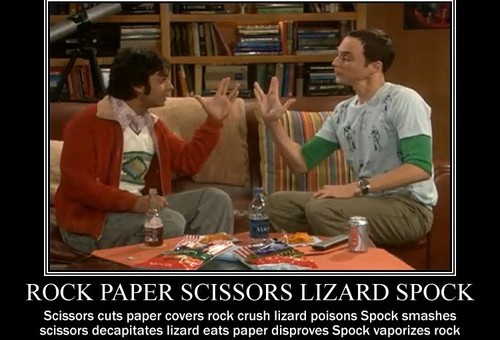

# Hackday Challenge


# Trek Game


## Technologies Used
  To build the game logic JavaScript was used along Bootstrap and  some custom CSS to create a web interface.
  - Bootstrap (v4)
  - AwesomeFonts (For Icons)

## Game Design
As the Trek game requires the follow values; scissors, paper, rock, lizard and spock. These were put in to an array as shown bellow.
```javascript
var gameValues = [“scissors”, ”paper”, ”rock”, ”lizard”, “spock”];
```
### Winning Combinations
Then to understand which player would win, winning combinations need to be created. For simplicity, winning combinations were created using the index number for each value within the gameValues array.
- Scissors Wins = [0] [1]
- Paper Wins = [1] [2]
- Rock Wins = [2] [3]
- Lizard Wins = [3] [4]
- Spock Wins = [4] [0]
- Scissors Wins = [0] [3]
- Lizard Wins = [3] [1]
- Paper Wins = [1] [4]
- Spock Wins = [4] [2]
- Paper Wins = [2] [0]
- Rock Wins = [2] [0]

### Grouping Winning Combinations
Refining and stucturing the winning combinations were grouped together by which values can win e.g. what conbinations are required for scissors to win. Grouping winning combinations together could also improve search efficiency as well as performance.
- Scissors Wins = [0] [1] OR [0] [3]
- Paper Wins = [1] [2] OR [1] [4]
- Rock Wins = [2] [3] OR [2] [0]
- Lizard Wins= [3] [4] OR [3] [1]
- Spock Wins = [4] [2] OR [4] [0]

### Constructing a 2d Array
Using this array to hold each of pair of winning combinations.
```javascript
var winningCombinations = [[0,1], [0,3], [1,2], [1,4], [2,3], [2,0], [3,4], [3,1], [4,2], [4,0]];
```

### Check Combinations
To determine which player has the winning value, each pair within the 2d array had to be evaluated from both sides (left to right) (right to left). So to understand which player had the winning value, the player 1 value needs to be compare player 2, then player value need to be compared to player 2. Only one combination will exist and this were the power of if statements can be used to find the winner as expressed bellow.

```javascript
function checkAnswers(answer1, answer2){
  if (player1Input === player2Input){
    console.log("It's a Draw!");
  } else {
    for (var i = 0; i < winningCombinations.length; i++){
        for (var k = 0; k < winningCombinations[i].length; k++){
          if (winningCombinations[i][k] === winningCombinations[i][0]){
            if(answer1 === winningCombinations[i][0] && answer2 === winningCombinations[i][1]){
              // Debugging
              console.log("[Player 1] is the winner used [" + gameValues[answer1] + "]. [Player 2] lost and used [" + gameValues[answer2] + "]");
              break;
            }
            else if (answer1 === winningCombinations[i][1] && answer2 === winningCombinations[i][0]){
              // Debugging
              console.log("[Player 2] is the winner and used [" + gameValues[answer2] + "]. [Player 1] lost and used [" + gameValues[answer1] + "]");
              break;
            }
          }
        }
    }
  }
}
```
# Web Interface
Additonal code was written to the checkAnswers function, to make the game interactive. This can all be view within [main.js](https://github.com/ConnorUnwin/DPD-Hack-Day-2019/blob/master/js/main.js)


# Winning
The web-interface when the user wins.


# Draw
The web-interface when there is a draw.


# Demo
<a href="./video/Demo.mp4" target="_blank"></a>
