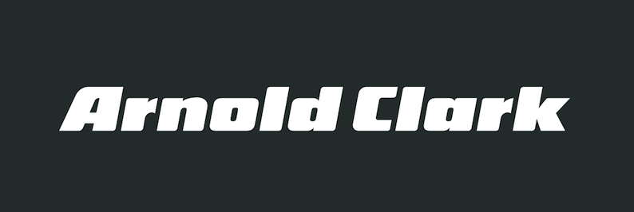
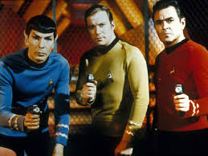
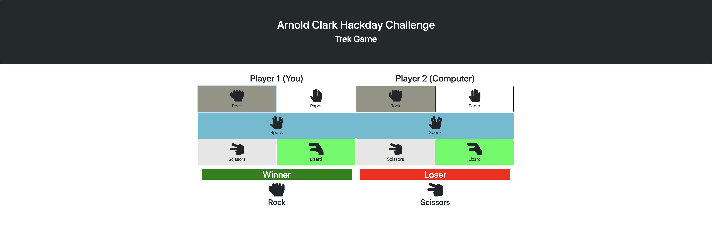
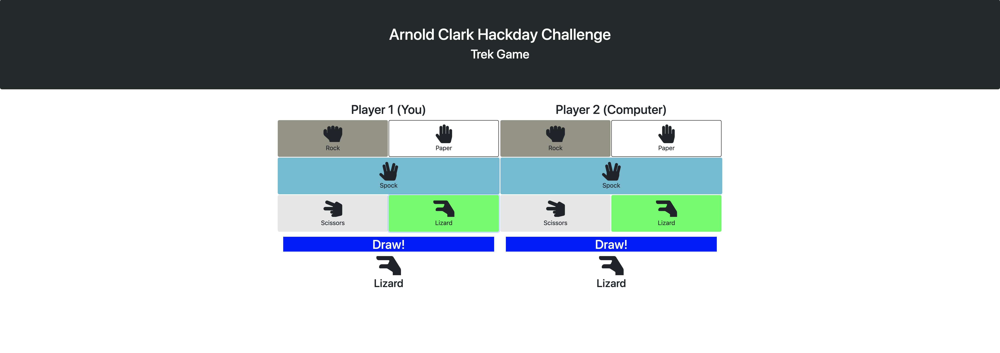

# Arnold Clark Hackday Challenge


# Trek Game


## Technologies Used
To build the game logic, JavaScript was used, then using Bootstrap along with some custom CSS to create a web interface for users to play.

- Bootstrap (v4)
- AwesomeFonts (Icons)

## Game Design
As the Trek game required the follow values; scissors, paper, rock, lizard spock, these were put in to an array as shown bellow.
```javascript
var gameValues = [“scissors”, ”paper”, ”rock”, ”lizard”, “spock”];
```

Then to understand which player would win, winning combinations need to be created. For simplicity, winning combinations were created  using the index number for each value within the gameValues array.

### Winning Combinations
- Scissors Wins = [0] [1]
- Paper Wins = [1] [2]
- Rock Wins = [2] [3]
- Lizard Wins = [3] [4]
- Spock Wins = [4] [0]
- Scissors Wins = [0] [3]
- Lizard Wins = [3] [1]
- Paper Wins = [1] [4]
- Spock Wins = [4] [2]
- Paper Wins = [2] [0]
- Rock Wins = [2] [0]

Refining and stucturing winning combinations were group together by which values can wins e.g. what conbinations are required for scissors to win. Grouping combinations together also improves search efficiency as well as performance.

### Grouping Winning Combinations
- Scissors Wins = [0] [1] OR [0] [3]
- Paper Wins = [1] [2] OR [1] [4]
- Rock Wins = [2] [3] OR [2] [0]
- Lizard Wins= [3] [4] OR [3] [1]
- Spock Wins = [4] [2] OR [4] [0]

### Construction a 2d Array

Using this to hold each of pair of winning combinations.
```javascript
var winningCombinations = [[0,1], [0,3], [1,2], [1,4], [2,3], [2,0], [3,4], [3,1], [4,2], [4,0]];
```

### Check Combinations
The function bellow was used to test two conditions, wither both players had the same values and which player had the correct combination from the winningCombination array. To check which player had the same value the

```javascript
function checkAnswers(answer1, answer2){
  if (player1Input === player2Input){

    console.log("It's a Draw!");
  } else {
    for (var i = 0; i < winningCombinations.length; i++){
        for (var k = 0; k < winningCombinations[i].length; k++){
          if (winningCombinations[i][k] === winningCombinations[i][0]){
            if(answer1 === winningCombinations[i][0] && answer2 === winningCombinations[i][1]){
              // Debugging
              console.log("[Player 1] is the winner used [" + gameValues[answer1] + "]. [Player 2] lost and used [" + gameValues[answer2] + "]");
              break;
            }
            else if (answer1 === winningCombinations[i][1] && answer2 === winningCombinations[i][0]){
              // Debugging
              console.log("[Player 2] is the winner and used [" + gameValues[answer2] + "]. [Player 1] lost and used [" + gameValues[answer1] + "]");
              break;
            }
          }
        }//end of inner for loop
    }// end of outer for loop
  }
}// end checkAnswers()
```

# Web Interface
Additonal code was written to the checkAnswers function, to make the game interactive to users and


# Winning


# Draw

